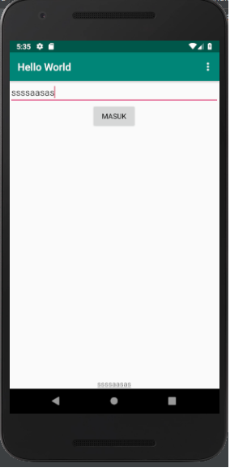

# HelloWorldApk 
[1/30 days push github challenge]

## source
* [Codepolitan](https://www.codepolitan.com/belajar-membuat-aplikasi-android-dengan-kotlin-untuk-pemula-bagian-1-activity-dan-layout-5aaa3f51344be)

## preview

